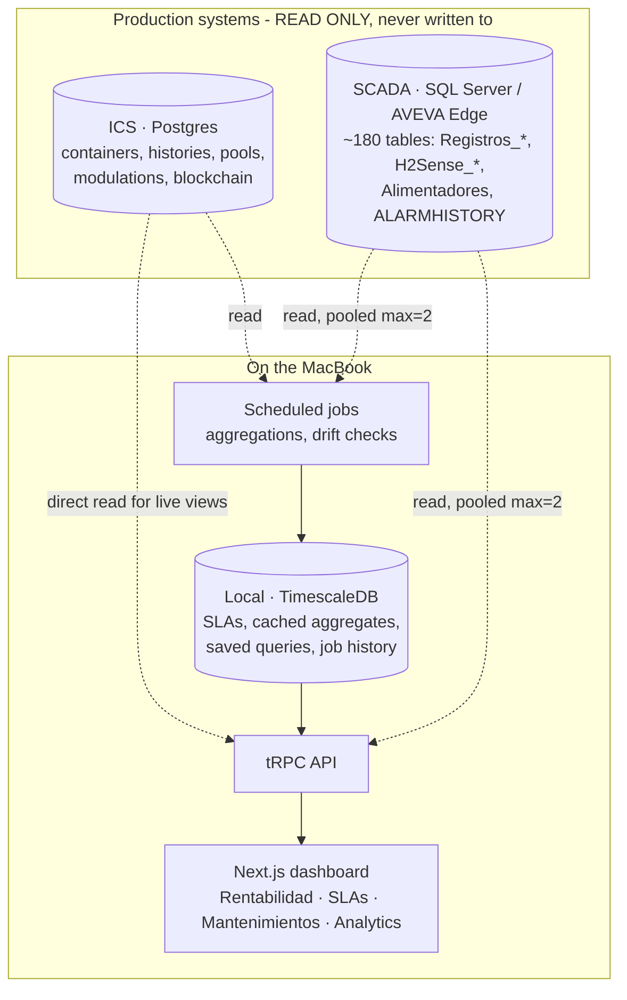

# Architecture — DC Hub

## Principle

ICS and SCADA are the source of truth. DC Hub reads them, cross-references
them, caches selectively for performance, and adds custom analytics on top. It never
becomes the system of record for operational data.

## Data flow

## Three data access modes

**Live views** — target <3s response, small result sets

- Read directly from ICS Postgres (current snapshots, small time windows)
- Read pre-aggregated SCADA tables (`Alimentadores`, `Auxiliar`, `PUE_Registros`)
- No expensive joins, time window always bounded

**Heavy analytics** — on demand, with progress indicator

- Direct SCADA queries with pooled connection, explicit timeout, `READ UNCOMMITTED`
- Results optionally cached to local DB if the query is repeated

**Scheduled jobs** — nightly / hourly

- Cross-source aggregations (e.g. ICS active_power vs SCADA real consumption per day)
- Long windows of history rolled up to hourly or daily
- Written to local DB for instant dashboard read

## Why not replicate SCADA fully

- ~180 tables, most repeat the same schema per physical unit (42× `H2Sense_*`, 100+×
  `Registros_*`). AVEVA Edge persists one table per tag group by design.
- Data volume at 1-minute granularity makes full replication expensive without payoff.
- SCADA already indexes on `Time_Stamp`; direct queries perform well when scoped.
- Replicating would add a sync lag and a failure mode we don't need.

## Why selectively cache ICS

- Live widgets should feel instant. Each widget hitting ICS over VPN on every render
  is slow and fragile.
- VPN drops shouldn't blank the dashboard. A thin cache of hot metrics keeps the base
  view functional offline (with a clear "stale since X" indicator).
- Scheduled jobs doing cross-source math need a stable local store anyway.

## Module composition

Each module is a self-contained route group + tRPC router + set of queries + a UI.
Modules share primitives (date range picker, site/project selectors, chart themes)
but own their business logic. Adding a module doesn't touch other modules.
